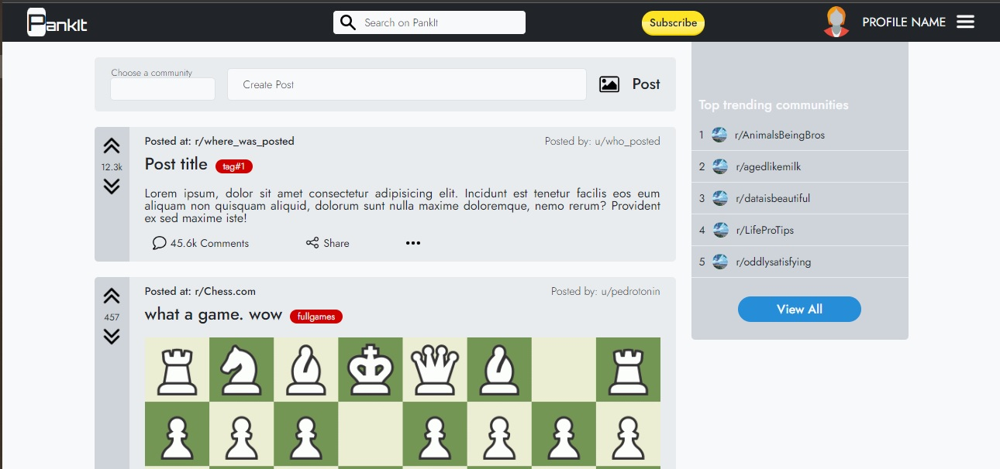
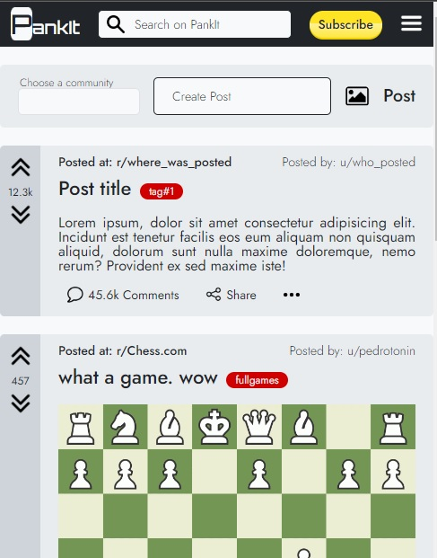

# PankIt

## Descrição

Este projeto é uma implementação de web design inspirada no site Reddit, utilizando apenas HTML e CSS puros. O objetivo é criar uma interface de usuário similar à do Reddit, responsiva, sem o uso de bibliotecas ou frameworks externos, apenas com a linguagem de marcação HTML e a linguagem de estilo CSS.

## Tecnologias Utilizadas

HTML5
CSS3

## Estrutura do Projeto

```plainText
nome-do-repositorio/
├── index.html
├── styles/
│   └── main.css
└── assets/
    └── images/
        └── logo.png
```

## Visualização

Para visualizar o projeto:

1. Clone o repositório para sua máquina local.

```bash
git clone https://github.com/PepeTonin/pankit-web-project.git

```

2. Navegue até o diretório do projeto.

```bash
cd pankit-web-project
```

3. Execute o arquivo `index.html`.

No S.O. Windows é possível fazer isso pelo terminal usando o comando:

```bash
start index.html
```

## Screenshots




